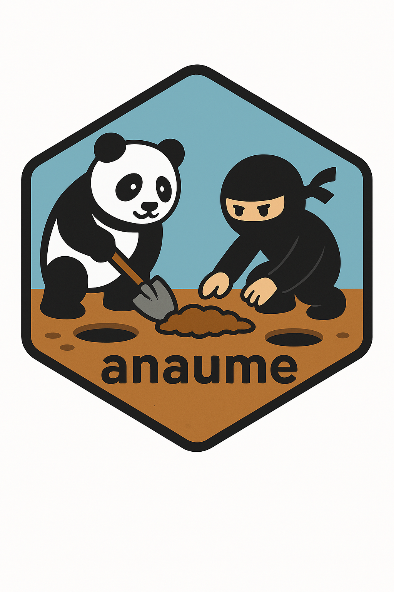

# anaume 

Package for generating analysis results for PMDA Query regarding adverse event in oncology therapeutic area `{anaume}`

## Purpose

To Create analysis results for PMDA Query regarding adverse event in oncology therapeutic area.
## Installation

Install the current release from CRAN:

```r
install.packages("anaume")
```

Install the development version from GitHub:

```r
# install.packages("pak")
pak::pak("phuse-org/anaume")
```

### Dependencies

The latest version of the package works with the latest versions of the
packages stated in `DESCRIPTION`.

## R Versions

Here's a summary of our strategy for this package related to R versions:

-   R versions for developers and users will be covered from R4.2.0.

## Contact

For bug reports and feature requests, please open an issue on
[GitHub](https://github.com/phuse-org/anaume/issues).
